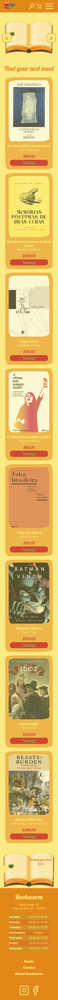
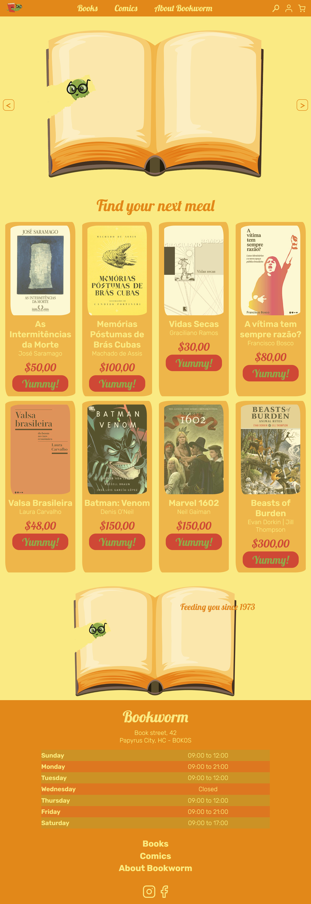

# Bookstore

### Highlights:
* Layout created on figma https://www.figma.com/file/GS4k8z1rKMab2FIJuYZThH/Bookworm?node-id=2%3A3
* Images treatment made using photoshop
* Burger button animation
* Fluid Typography
* Mobile-first
* Responsivity from 300px to 2600
* Burger menu turned into close button
* :mage: Infinite carousel made with pure JS (no libraries used)
* :gear: Different transition timing for hover on and off

### Tecnologies used:

* HTML
* CSS
* Javascript

### Planning/Timeline

- [X] Uncheck all checkboxes when a new one is checked
- [X] Make other arrows unrotate and submenus slide back when another checkbox is checked 
- [X] Uncheck all checkboxes when burger menu is closed
- [X] Set submenu position based on its height
- [X] Make subsection appear on left
- [X] Animate subsection
- [X] Position arrow on the left
- [X] Animate arrow
- [X] Style submenu
- [X] Increase header's margin-bottom according to menu height
- [X] Text Feeding you since... over image of  eaten book
- [X] Show Swiper
- [X] Control Swiper
- [X] Images treatment at photoshop
- [X] Insert new images in cardsection
- [X] Subsection filters books on click
- [X] Card styling
- [X] Filter scrolls to main part
- [ ] Cart
- [ ] Clicking on logo shows all books
- [ ] Clicking on burger--menu--list--item--link triggers arrow
- [ ] Submenu appers on hover (width > 800px)

### How to open:

Access: https://marcelluscaio.github.io/Ecommerce_Livraria/

